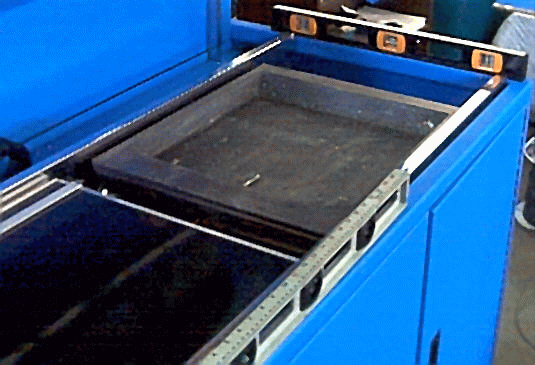
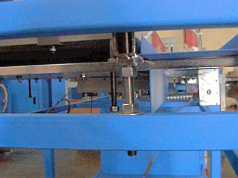

# INSTALLATION

The **UNIT**DESIGN soldering and tinning machines are designed to be easily set up. The following installation instructions will allow you to prepare the machine for actual start-up. Do not attempt to run the machine without first following these steps:

1. Remove all packaging material. Cut all metal and plastic straps. Remove padding from the hood supports. DO NOT ATTEMPT TO ROLL THE CARRIAGE.

1. Level machine. Using a carpenter’s level placed on the aluminum frame, adjust the four outer leveling pads using a wrench. Level the frame in both axes, left to right and front to back.

    { width=4.25in }

1. Confirm that the chrome rails are level. Using a carpenter’s level placed on the chrome rails, check both axes of the rails. The rails are leveled to the frame at the factory but the studs may have loosened during shipment. The rail mounting studs can be accessed through the panels at the ends of the machine. Before adjustment, be sure to loosen the nut below the mounting bracket which locks the stud position. If necessary adjust the rail mounting studs using a wrench. Once the rails are level, tighten the lower nut to lock rails in position.

    { width=4.25in }

1. Make sure the solder pot is resting on its 4 adjustment bolts. There have been instances where the pot has shifted during shipment due to rough handling.

1. Connect Power. All electrical connections should be made by a qualified electrician. The main power connections are made in an electrical box located on the rear panel at the loading end of the machine. Refer to the Facility Connections section of the manual for voltage requirements.

**CAUTION:**

**ALWAYS SHUT OFF MAIN POWER BREAKER AT SOURCE BEFORE REMOVING ELECTRICAL BOX COVER!**

