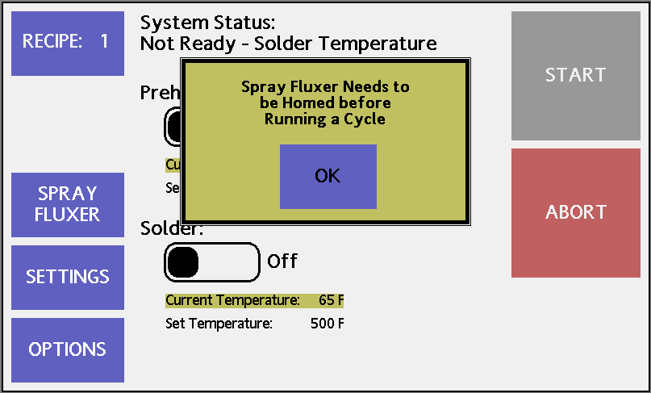
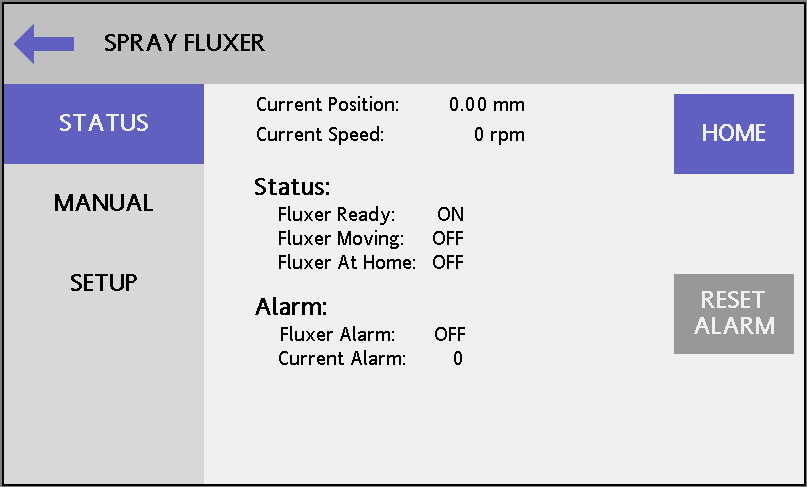
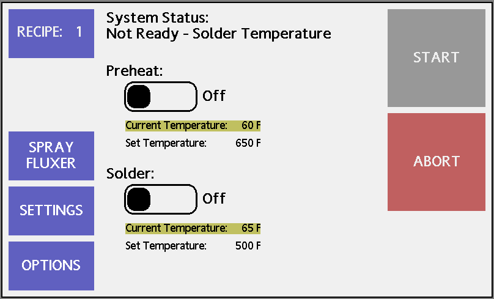
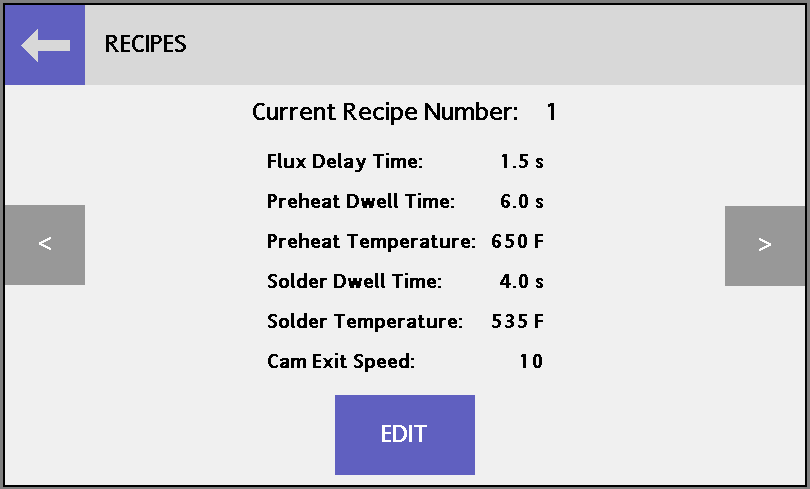
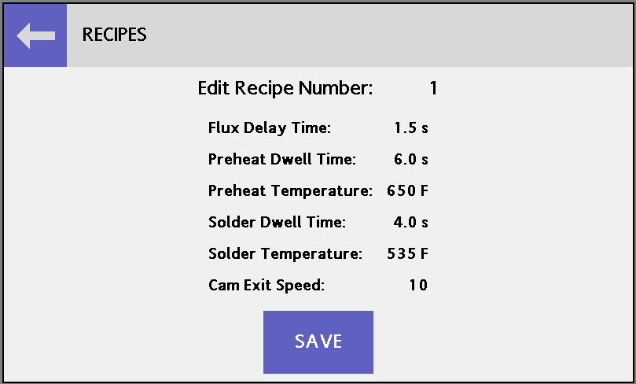
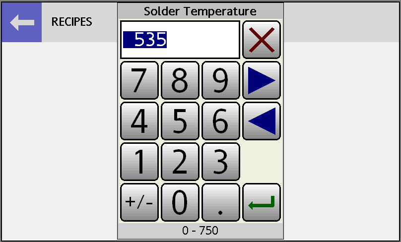
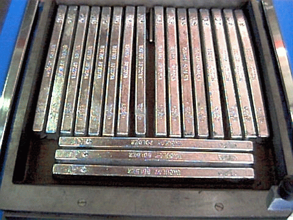
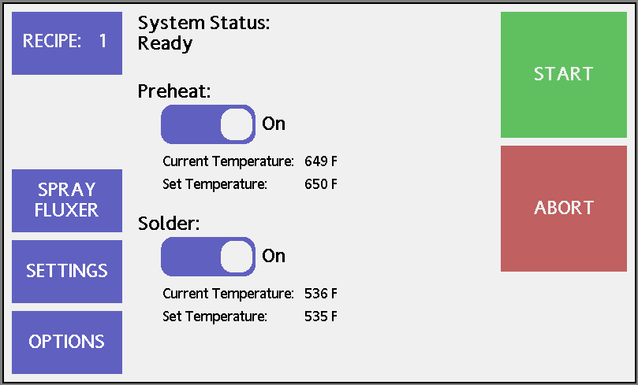
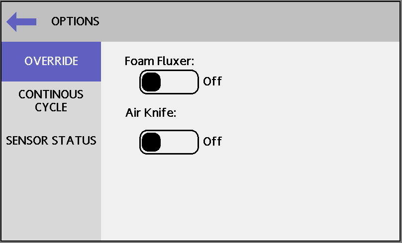
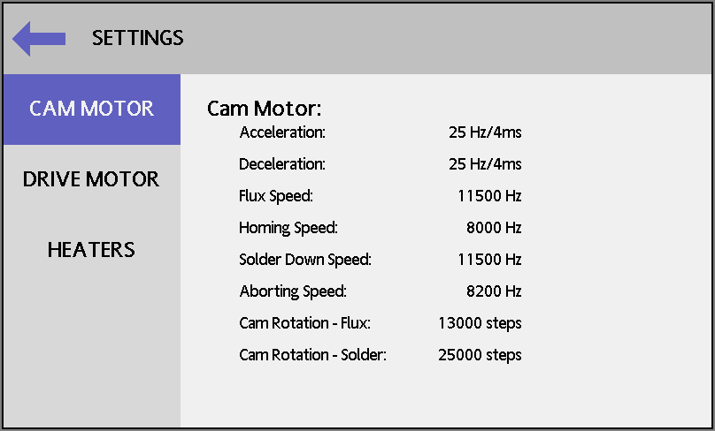

# INITIAL START-UP

## SET UP SPRAY FLUXER HOME POSITION (MDS-220)

1. Turn the main power switch, located on the power module cover, to the ON position. The control module should power up and the following display should be visible on the touchscreen.

    { width=4.25in }
    
1. Whenever the machine is powered on, the home position of the spray fluxer actuator needs to be set. At startup a pop-up will remind the operator. Press the OK button on the pop-up window. The display will shift to the Spray Fluxer Status screen.

    { width=4.25in }
    
1. Press the Home button to send the spray fluxer to its home position. The actuator will retain its home position while it is powered on. Press the Back arrow in the upper left of the screen to return to the Main Menu.

## SET UP START POSITION

In order for the carriage to run, the START button on the touchscreen must be green. The START button will change from gray to green once the solder pot reaches the set temperature the first time after it has been turned on. The ABORT button on the touchscreen will always bring the carriage back to the home position regardless of the current solder pot temperature.

{ width=4.25in }

1. Press the red ABORT button on the touchscreen. The carriage will now move to the home position, which is at the extreme left end of the stainless steel rails.

## PROGRAM TEST RECIPE

In order to initial charge the solder pot and check the solder level, a initial test program will need to be programmed. The desired solder temperature of the solder alloy being used will be required when setting up the recipe. Here is the test recipe using lead solder.

  Parameter       | MDS-200/220 
  ----------------|---------
  Flux Delay      | 2 s     
  Preheat Dwell   | 10 s    
  Preheat SP      | 650 °F 
  Solder Dwell    | 10.0 s
  Solder SP       | 500 °F     
  Exit Speed      | 10      

1. Press the Recipe button in the upper left corner of the Main Menu screen. The Recipe Summary and Selection screen will appear.

    { width=4.25in }

1. Press the Edit button at the bottom of the screen to change the Recipe parameters.
    
    { width=4.25in }
    
1. Pressing the number displayed next to each parameter will cause the keypad pop-up to appear. They keypad can be used to edit the parameters. The left and right arrow keys can be used to cycle through all of the parameters displayed. Minimum and maximum values are displayed at the bottom of the keypad.

    { width=4.25in }

1. When all parameters have been edited, press the enter key to close the window.

1. Press the Save button to store the new recipe parameters in the controller's memory.

1. Press the Back arrow in the upper left of the screen to return to the Main Menu.

## CHARGE THE SOLDER POT

The solder pot holds about 150 lbs. (68 kg.) of solder, but only a fraction of that should be loaded at one time. We recommend high purity lead or lead-free solder for all work. 

1. Place about 25 to 50 lbs. of solder bars into the pot, covering the bottom surface of the solder pot. Place them neatly and try to cover as much of the bottom surface as possible. CAUTION: DO NOT BUMP OR DENT THE THERMOCOUPLE WELL. This could cause an external leak or make the thermocouple difficult to remove.

    { width=4.25in }

1. On the Main Menu, confirm that the set temperature under the solder label is the desired operating temperature. Press the toggle button underneath the solder label to enable the solder pot heaters. The actual solder temperature should begin to rise.

1. It will take about 20-30 minutes for the initial solder charge to start melting. Once the solder in the solder pot has melted and the actual solder temperature has reached approximately 450°F, carefully add solder by sliding bars into the pot. Be careful not to splash hot solder and not to hit the thermocouple centered at the left end of the pot. Keep adding solder until the solder level is .075" to .100" from the top of the solder pot rim.

1. As the level gets closer to the rim of the solder pot, check to see if the solder is level in respect to the solder pot. Before the  machines leave the factory, the solder pot level and height are checked in relationship to the frame. If the solder is not level in the pot, most likely the frame is not level in one or both horizontal axes. Adjust the frame as necessary.

    > If the solder pot requires minor adjusting, extreme care should be exercised because of the danger of hot solder. Adjustment of the solder pot is done by turning the hexagonal bolt heads of the leveling screws located below the solder pot. If the solder pot is lowered too much, the boards may not reach the solder. BE SURE TO TIGHTEN THE LOCK NUTS AFTER ADJUSTMENT.

## CHECK SOLDER LEVEL WITH CARRIAGE

Once the solder pot is fully charged with solder (.075" - .100" from the top), you may confirm accurate solder level by performing the following test:

1. Take the PCB carrier and move the single finger bars to the maximum width possible by loosening the screws, sliding the bars outward, and then re-tightening. The fingers should be inclined inward. Place the PCB carrier on the carriage. You are now ready to run a test cycle through the system to confirm solder pot level.

1. Press the Recipe button on the Main Menu. Confirm that the parameters match those programmed in the last section. The important parameters for this test are the solder temperature and the solder dwell time. Then press the Back button to return.

    > Note: The machine will not operate if the START button is not green, signifying that the solder is at the correct temperature. Also if the carriage is not at its home position the cycle will not start.

    { width=4.25in }

1. Press the green START button. If the START button is green and the unit does not operate, simply lift the end of the carriage and push slightly forward, then press the red ABORT button. This should automatically bring the carriage to the start or home position. If the unit will still not cycle, please refer to the Troubleshooting Section of the manual.

1. During the solder immersion, set for 10.0 seconds, observe the solder level in relation to the PCB carrier fingers. The solder level should be at the center of the “V” shaped, board gripping sections of the fingers in the corners of the carrier.

1. If the “V” sections don’t enter the solder, you need to add more solder. If they are not equally deep in the solder you need to re-level the system. Remember, the liquid solder is the ultimate level and you want to have it equidistant down from each pot edge. To re-level the machine, first level the frame, then the rails and finally level the solder pot. After re-leveling run the test again.

    { width=4.25in }

Now you should run a practice scrap PCB to make the final test. 

1. Leaving the carrier on the carriage at the loading (left) end, loosen the finger bars and move them towards the center. First tighten one bar, then place the PCB in the finger “V”s. Slide in the other bar and tighten. Finger pressure should not be excessive, just tight enough to hold the board securely. You should be able to get the board in and out of the fingers without loosening the finger bars. Excessive spring pressure may cause some boards to warp as they soften at the soldering temperature.

1. Now cycle the carriage by pressing the START button. During the solder immersion, check that the solder level is equal on all four sides of the PCB. If you are using a small PCB, we suggest using two or more boards spaced strategically to perform the test. The solder level should visually show about .030" PCB immersion.

If the machine level is still off, re-level the frame, rails and/or solder pot. Again, make sure the solder level is equal on all four sides of the solder pot to avoid the possibility of solder spillage at some future time.

## FILL AND ADJUST FOAM FLUX TANK (MDS-200)

Now that the solder is melted, the solder pot is leveled and the solder level is correct, you may fill and adjust the foam flux tank.

Remove the carrier from the carriage. Using a foaming type flux, fill the flux tank with 1½ - 1¾ gallons of flux. The flux level should be about one inch below the weld line on the foam funnel.

> CAUTION: Be sure that the external Drain hose is attached to the hose clips on the outside wall of the flux tank to avoid spills.

1. Once the flux tank is full, be sure that the air hose is connected between the fluxer and the bulkhead fitting (as described in the installation section of this manual).

1. Attach an air supply line to the fitting located next to the electrical box on the right rear panel of the machine.

1. Turn the flux system regulator, the left of the two regulators located behind the left set of doors, completely counter-clockwise (off). 

1. On the Main Menu screen on the operator interface press the Options button. The display will change to the Options screen. Select Override on the left menu. This displays a screen that allows the flux system and air knife to be turned on manually to facilitate setup. Press the button for the flux system and the air solenoid will open allowing air to flow to the airstone.

    { width=4.25in }

1. Slowly turn the flux system regulator clockwise until the gauge displays 10-15 psi.

1. The flux should now be foaming. Note: Not all fluxes are alike. Some require a low air flow while others require high air flow. You should see at least a ½" foam height above the foam funnel. You may need to adjust the flux system regulator to achieve these conditions.

1. You are now ready to adjust and level the fluxer. Use the T-handled Allen wrench, included with the machine, to raise the foam fluxer. Raise the fluxer as high as possible while not restricting the leads beneath your boards. It may be helpful to place a board into the carrier.

1. Once you are finished setting up the flux tank press the OFF button on the Override Screen to shut off the foam fluxer.

1. Once the fluxer has been mechanically raised to the approximate position, the height of the carrier as it passes over the foam fluxer can be adjusted using the control system. On the Main Menu screen, press the Settings button and then select Cam Motor on the left menu.

    { width=4.25in }

1. The parameter "Cam Rotation - Flux" controls how far the cams rotate before passing over the fluxer. This can be used to provide fine adjustment of the height of the carrier during the application of flux. This parameter ranges from 0 (cams fully up) to 26250 (cams fully down). Typically it will be around 12000 - 14000 steps.

## FILL AND ADJUST THE SPRAY FLUX SYSTEM (MDS-220)

Now that the solder is melted, the solder pot is leveled and the solder level is correct, you may fill and adjust the spray flux system.

The nozzle positioning actuator was homed during the initial power up process detailed above. This will need to be repeated each time the machine is turned on. No other initial adjustments are normally required fo the upper portion of the spray fluxer.

The next step is to fill and adjust the tanks and regulators in the lower section.

> CAUTION: Before opening the flux or purge tanks, be sure that the main air pressure to the machine has been turned off.

1. Turn off the main air supply using the Main Air Regulator mounted to the rear of the machine or an external shutoff valve.

1. Release the lid latches and open both tanks

1. Fill the larger flux tank with up to 2 gallons of the desired flux. Be sure that the output tube is submerged below the surface of the flux. Close and latch the lid.

1. Fill the smaller purge tank with up to 1 gallon of the specified thinner for the flux being used. Be sure that the output tube is submerged below the surface of the flux. Close and latch the lid.

1. Turn on the main air supply.

1. Set the regulators to the desired liquid feed and atomizing pressures or use the factory settings. Explanations of the effects of each regulator are found in the Operation section of the manual.

1. Press the green START button to cycle the machine.

1. Check that as the carriage passes over the fluxer the spray nozzle should cycle back and forth under the carriage. The flux or thinner and the atomizing air should flow during the fluxing process.

1. Make sure the exhaust system is capturing any over-spray.

## SETUP SUMMARY

During the initial setup, you should have completed the following steps:

1. Leveled the frame and rails.
1. Filled solder pot with solder.
1. Confirmed solder level with trial dry run.
1. Run scrap board.
1. Setup flux system.
1. Filled fluxer with flux.

If the above steps were completed successfully, you are now ready to solder boards.
