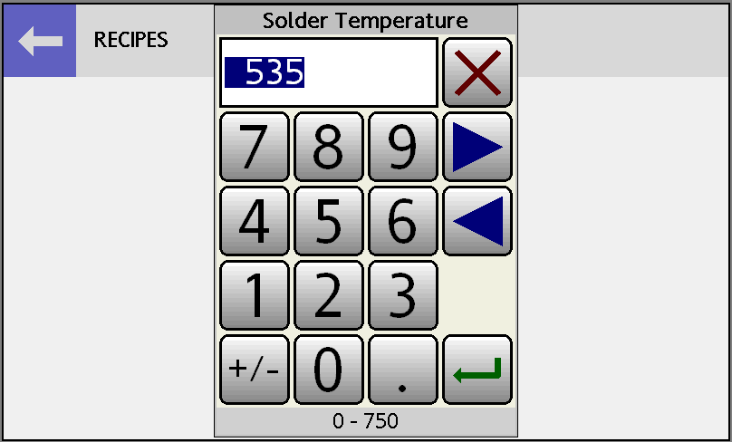
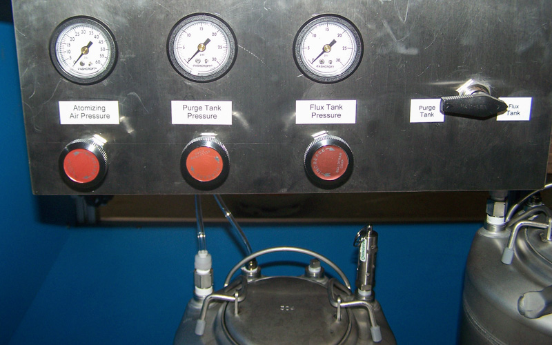

# OPERATION

## PROCESS PARAMETERS

There are an infinite variety of possible parameter sets for the **UNIT**DESIGN MDS Soldering Systems.

We will start with a generic parameter set which generally works well on most types of boards. We recommend the following parameters for water-soluble (OA) and No-Clean Fluxes with lead based solder. For lead-free solders, use the solder temperature recommended by the solder vendor for the specific alloy. NCFs require more dwell time at the preheat stage and less dwell time in the solder. A water carrier flux will take a longer preheat dwell than an alcohol based flux. The other parameters will be similar to the alcohol based version of that flux.

  Parameter       | MDS-200 | MDS-200 | MDS-200    | MDS-220 | MDS-220    
  ----------------|---------|---------|------------|---------|------------
  Flux Type       | Rosin   | OA      | Low-Solids | OA      | Low-Solids
  Flux Delay      | 5 s     | 5 s     | 10 s       | 2 s     | 2 s        
  Preheat SP      | 650 °F  | 650 °F  | 650 °F     | 650 °F  | 650 °F  
  Preheat Dwell   | 20 s    | 25 s    | 30 s       | 25 s    | 30 s
  Solder SP       | 500 °F  | 500 °F  | 500 °F     | 500 °F  | 500 °F
  Solder Dwell    | 3.5 s   | 3.0 s   | 1.5 s      | 3.0 s   | 1.5 s
  Exit Speed      | 12      | 12      | 18         | 12      | 18

## OPERATOR INTERFACE OVERVIEW

Using the touchscreen interface of the control module, the operator can set, change, store in memory or recall all of the soldering parameters described above. The touchscreen is the central operation point for all of the MDS Soldering and ALT Tinning Machines.

{ width=4.25in }

Information displayed:
- Currently Selected Recipe Number
- Current System Status
- Preheat Temperature - Current / Set
- Solder Temperature - Current / Set

Available Control Buttons:

- **START** - Starts the soldering cycle. (Turns green when solder is up to temperature)
- **ABORT** - Stops the soldering cycle and returns carriage to the home position.
- **Preheat On/Off** - Turns on and off the Radiant Panel Preheater.
- **Solder On/Off** - Turns on and off the Solder Pot heater.
- **Recipe: #** - Switches to the Recipe Summary and Selection screen.
- **Spray Fluxer** - Switches to the Spray Fluxer screen to set spray fluxer parameters. (MDS-220)
- **Settings** - Switches to the Settings screen to change certain machine settings.
- **Options** - Switches to the Options screen in order to manually trigger devices and check sensor status.

## SELECTING A PROCESS RECIPE

In order to view the parameters of the currently selected recipe or select a different recipe, press the Recipe button in the upper left corner of the Main Menu screen. The Recipe Summary and Selection screen will appear.

{ width=4.25in }

The current recipe number and parameters are displayed. The available recipes cam be selected using the arrow buttons ay the left and right sides of the screen. Once the desired recipe is displayed, press the Back arrow to return to the Main Menu screen.

It is a good idea to check the Recipe Summary screen to ensure you are running the correct parameters for a given board type.

## PROGRAMMING A RECIPE

The currently selected recipe’s parameters are used as the starting point for a new recipe to be created, so if you wish to change a parameter in a previously saved recipe, first select that recipe, then press the Edit button. 

{ width=4.25in }

This screen allows all of the parameters to be set. To change a parameter setting press the number you wish to change. The Keypad window will then appear.

{ width=4.25in }

Type the new setting on the keypad and press the enter key. If you wish to erase the setting you just made press the close (X) key. Use the arrow buttons to cycle through the available parameters. Enter the new settings for each parameter and press enter. You do not need to close the keypad window until all the changes you wish to make are accomplished. Once you are finished making changes, close the keypad window. Press the Save button to store the recipe in the controllers memory.

Once all recipe editing is complete, press the Back arrow button to return to the Main Menu screen.

## BOARD INSPECTION

Once the above parameters are set, the preheater and solder are up to temperature and the START button on the Main Menu screen is green, you are ready to solder a board.

Using the adjustable finger bars on the carrier, adjust the bars to just hold the board. Excessive finger pressure on the board could cause it to warp when it enters the solder. The board should be held just tight enough to prevent the board from falling out or floating off during soldering.

Make sure the compressed air supply for the fluxer is turned on and that the pressure regulators are set correctly.

Press the green START button located on the Main Menu screen. The cams should home themselves and after the programmed flux delay the carriage should begin to roll forward towards the fluxer. If this fails to happen press the red ABORT button. The carriage should return to the home position. Press the START button to try again.

> **Note:** Pressing the red ABORT button will not immediately stop the carriage, but rather it will allow the carriage to finish its direction of travel to a convenient preprogrammed point, before it returns to the home. This prevents the dross skimmer blade from getting caught.
>
> As long as the ABORT button is pressed anytime prior to the board entry into the solder, the controller will not allow the boards to be soldered.

Watch the entire process and check the following conditions:

- Did the board seem to get adequately fluxed? (Look at the bottom of the board - adjust fluxer settings if necessary.)

- Did the board dip evenly into the solder? (If necessary, level the solder pot.)

- Did solder wick up to the topside of the board early in the solder dwell time? (If so, reduce dwell time.)

- Is bridging present? (Increase solder dwell time and/or preheat time, decrease dwell time if using no-clean flux, reduce exit speed)

- Is there excessive solder present? (Increase solder dwell time and/or preheat time, decrease dwell time if using NCF)

- Are there solder voids? (Ensure adequate fluxing and coverage.)

When using rosin and water-soluble fluxes, the longer the board remains in the solder the less chance that bridging will occur. This is due to the fact that a longer dwell time increases the board temperature and therefore the amount of solder drainage. Boards which are inadequately heated tend to cool off while the solder is still draining, thereby allowing bridges to form.

When using no-clean fluxes the opposite tends to be true. While the board is immersed in the solder, the fluxes are losing activity. Therefore the longer the boards remain in the solder the harder it is for the excess solder to drain away, causing bridging. This is why NCF solder dwell times tend to be shorter than those with rosin and water-soluble fluxes.

One other area to consider is the mass of the components on the board. Boards with heavy components, such as transformers, need higher preheat and solder dwell times in order to form good solder joints. The high mass components require a greater heat input to bring them to the soldering temperature.

Finally, if you are using a water based flux, usually called a water carrier flux, be sure to use a long enough preheat dwell time. Since water is the solvent instead of isopropyl alcohol, it takes longer to evaporate all of the solvent off of the board. If any water is left on the board when it enters the solder, it will flash boil, causing large solder voids and possibly damage to components.

## SOLDERING PARAMETERS

We encourage you to contact **UNIT**DESIGN if you require assistance in obtaining a proper parameter set for your boards.

A specific explanation of the soldering parameters follows:

### Flux Delay

*Parameter Range: 0 - 99 sec.*

The flux delay is the amount of time that the machine waits before starting to move the carriage over the fluxer. With a foam fluxer this gives time for the foam head to build up. On the MDS-220 this delay allows the spray nozzle atomizing air supply to build pressure before allowing the flux to spray. Typically this delay is 2-3 seconds.

### Preheat Temperature Set Point

*Parameter Range: 0 - 800°F*

The Preheat set point controls the temperature setting for the surface of the preheater. The recommended setting range is 650 - 700°F with a maximum of 800°F. If a slower preheater ramp rate (the rate at which a board heats up, measured in degrees per second) is desired, lower the preheat temperature and increase the preheat dwell time. We do not recommend running the preheater temperature below 425°F.

Conversely, you can reduce the preheat time by raising the preheat temperature. For example, 30 seconds of preheat over a 600°F preheater may produce the same results as 20 seconds over a 700°F preheater. The difference would be the ramp rate, the boards over the 700°F preheater would be heating up at a faster rate. This rate becomes critical with certain materials, especially ceramics, which usually have a maximum heating ramp rate.

### Preheat Dwell Time

*Parameter Range: 0 - 999 sec.*

If alcohol based MIL-spec rosin fluxes are being used, the volatiles are easily removed with a 30 to 90 second preheat on an MDS-100, or a 20 to 50 second preheat on an MDS-200/210. Alcohol based water-soluble fluxes require a similar preheat dwell time.

No-clean fluxes require more preheat to activate the flux and to remove almost all the flux thinner. After the soldering process, very little residue should be left on the board. If excess flux residue is still on the board after soldering, more preheat dwell time or a higher preheat temperature is needed.

Water based fluxes require a longer preheat dwell time due to the lower volatility of water in comparison with isopropyl alcohol. Thick boards, ones with large ground plates, or ones with high mass components will also take longer to heat up and therefore require a longer preheat dwell time.

Almost always a longer preheat dwell time will increase soldering quality. However, a longer preheat will reduce the daily production potential of the soldering machine. Therefore, start with higher times and reduce them slowly, while observing the quality of the soldered PCBs.

### Solder Temperature Set Point

*Parameter Range: 0 - 750°F*

The temperature selected for Sn63 solder should fall into the 480 to 520°F range. Set temperatures for lead-free alloys have a greater range depending on the alloy used. The solder manufacturer should be consulted for the proper temperature. Using a lower temperature means increasing solder dwell times to avoid cold joints, but this has a negative side to it. Longer dwell times mean that the board is being exposed for long durations to possibly damaging heat. Higher solder temperatures also have a downside as they will accelerate dross formation, and possibly could damage the PCB or components. (Dross is the gray oxide layer formed on the top of the solder pool.) Overall, higher solder temperatures allow more drainage during the solder exit.

### Solder Dwell Time

*Parameter Range: 0.0 - 99.9 sec.*

The dwell time for rosin fluxes is normally 3.5 to 4.0 seconds with military specifications limiting solder dwell times to 5.0 seconds. No-clean Fluxes typically need only 1.2 to 1.8 seconds. Water soluble fluxes usually require about 2.5 to 3.5 seconds.

If a board has plated through-holes, you can determine the correct setting by watching the top of the board as it dwells in the solder. Watch for wicking action up to the top of the board. The dwell time should be set to allow two or three tenths of a second between the time solder wicks to the top of the holes and the board begins to exit the solder. No-clean fluxes typically have a very fast wicking action and therefore need only a short dwell time.

A better method to determine optimum solder time for a new board is to locate the component or area that has the greatest amount of metal and/or the largest diameter leads. Adjust your soldering so this component or area solders adequately. The less difficult or smaller solder points will have been acceptably soldered automatically. This is even applicable to non-plated through-holes where wicking does not take place. However, some wider or thick buss leads, or connectors, will give excessive time indications.

### Exit Speed

*Parameter Range: 1 - 50*

This is a relative number that determines the cam rotation speed during the exit sequence from the solder bath. In an MDS Soldering Machine, one end of the PCB is lifted first to allow for solder drainage, or peel-back, before the other end is lifted. This process is critical to prevent icicles or bridging. 

The higher the exit speed number, the faster the PCB exit speed. You won’t notice any speed difference between adjoining settings, but there will be a quality difference. There is a noticeable difference between numbers several digits apart.

## SPRAY FLUXER  (MDS-220)

The main factors that can be adjusted relating to the spray fluxer are the amount of flux deposited and the degree of flux atomization. These factors are adjusted using the air regulators located in the lower section of the spray fluxer.

{ width=4.25in }

### Flux Amount

The amount of flux applied by the spray nozzle is determined by the feed pressure of the liquid at the nozzle. The spray nozzle mixes the liquid with the atomizing air external to the nozzle and so the flux flow rate is controlled by the tank pressure independently of the atomizing air pressure. The flux and purge tank regulators control the pressure of the air in the tanks, in turn creating the liquid feed pressure.

The easiest way to increase or decrease the amount of flux applied is to adjust this air pressure up and down. The table notes the flow rates at various pressures for the standard nozzle. 

Pressure | Flow
---------|--------
3 psi    | 1.2 gph
5 psi    | 1.6 gph
10 psi   | 2.2 gph
20 psi   | 3.1 gph

In this application the relative difference is more important than the actual values. For example, changing the tank pressure from 3 to 10 psi almost doubles the flow rate.

### Flux Atomization

The degree of atomization is controlled by the leftmost air regulator. This will control how fine of droplets are sprayed on the board. A higher air pressure will create smaller droplets. The atomizing pressure range is dependent on the liquid feed pressure. As the liquid pressure is raised, a higher atomizing pressure is required to maintain the same droplet size. The table lists the standard ranges at various liquid pressures.

Liquid Pressure | Atomizing Pressure
----------------|-------------------
3 psi           | 5 - 25 psi
5 psi           | 10 - 30 psi
10 psi          | 15 - 40 psi
20 psi          | 25 - 60 psi

## PROCESS CONSIDERATIONS

### CARRIERS

To increase productivity, production houses should obtain multiple carriers. Determine the number of boards to be run per load based on the amount of time the operator spends to unload and then load a carrier. High production numbers of small boards are achieved by using three carriers and two operators. The operators could also clean the newly soldered boards, increasing productivity.

### COMPONENT ORIENTATION

If you are soldering components with rectangular leads (for example: SIPs or DIPs), they should be oriented parallel to the direction of travel of the carriage. This will provide the best possible solder joint and minimize bridging.

### FIXTURING

One of the unique advantages of a **UNIT**DESIGN machine is the ease of special fixturing. While conveyor systems need multiple specialized holders for fixturing. **UNIT**DESIGN carriers can be very easily modified by unscrewing finger pairs, using multiple bars, bending fingers, or attaching special wires or holders to the finger bars.

WARNING: DON’T BEND THE TITANIUM FINGERS TOO MANY TIMES, AS THEY ARE QUITE BRITTLE.

Contact **UNIT**DESIGN for your custom fixture requirements.

### MASKING

Any automatic soldering process will solder all of the metal that touches the solder bath. In many cases, this is the goal or at least it doesn’t negatively impact the PCB. Sometimes there are exposed places you do not wish to solder, such as:

- holes that are to be used later,
- edge connectors,
- components attached with screws,
- items plated with cadmium, zinc or nickel,
- items made of brass, etc.

These can be masked off by using a soluble solder mask, by being taped over, or by using edge connector protectors. We suggest obtaining a solder mask which will be soluble in the cleaner that you will use for removing the flux residue.

If you there are large areas on the board that you do not wish to solder you may want to consider having a custom selective soldering pallet manufactured. This will expose only the area you wish to solder and keep the rest of the board protected.

### RESOLDERING PC BOARDS

Depending on what the original problem was, the MDS Soldering Machines lend themselves very nicely to resoldering PCBs.

### CLEANLINESS

Most soldering problems are caused by contamination of the components or boards. Dirt and oils interfere with the metal surface activation by the flux. Also a humid environment will cause metal surfaces to oxidize heavily. To this end it is necessary to store pre-soldered boards and components in a clean and dry place.

### SOLDER PURITY

At **UNIT**DESIGN we recommend using a high purity solder for all operations. We also recommend having the solder bath analyzed at regular intervals to check for contamination. Avoid contaminants such as parts made of zinc or brass, and gold-plated parts. The worst contaminants tend to be aluminum, cadmium and zinc.

