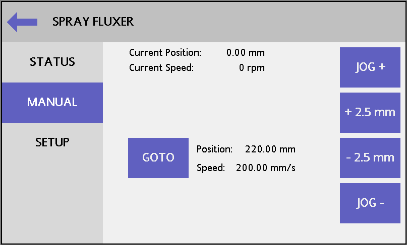
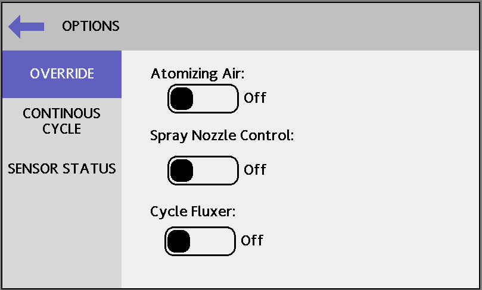

# PREVENTATIVE MAINTENANCE

There is very little maintenance required on the **UNIT**DESIGN machines. Also, the maintenance that is required is very simple to perform.

## RAILS

Since the carriage is self-propelled (via a drive wheel system), dried flux, solder and other materials on the rails could restrict the carriage from free travel. We recommend a daily rail cleaning with alcohol or a citrus based cleaner. Water soluble fluxes tend to be quite corrosive to sheet metal parts, therefore care should be taken to clean up spills and splatters.

## WATER TRAP

Before each use, be sure to empty the water trap located below the main air pressure regulator. Simply twist the valve underneath the bowl counterclockwise to empty the water trap.

## SPRAY FLUXER PURGE

The spray fluxer system is equipped with a purge function, which will use the flux thinner to displace any flux remaining in the upper section of the fluxer and from the internal passages of the spray nozzle. The spray nozzle is equipped with a clean out needle which will normally keep flux from building up at the spray nozzle orifice. Every time the spray valve cycles on and off the needle removes flux build up and keeps the nozzle from dripping.

It is a good idea to purge out the system at the end of the day to prevent and solids from building up inside the nozzle and lines.

1. Make sure the purge tank is full and the Purge Tank Pressure air regulator is set to the desired pressure. Turn the tank selection valve to the Purge Tank side.

1. On the Main Menu, press the Spray Fluxer button, then press Manual along the left side to access the Spray Fluxer Manual Control screen.

    { width=4.25in }

1. The Spray Fluxer Manual Control screen can be used to manually position the spray nozzle. When purging the spray nozzle should be placed near the center of travel to minimize the flux residue build up on the carriage plates or rails. A typical location for purging would be at 220 mm from home. Pressing the Goto button will cause the actuator to move the nozzle the programmed position.

1. Once the nozzle is in position press the back arrow to return to the Main Menu.

1. On the Main Menu, press the Options button. The Override Options screen should appear.

    { width=4.25in }
    
1. The Override Options screen contains controls to manually turn on the spray nozzle. Press the Atomizing Air toggle to turn on the airflow to the spray nozzle.

1. Once the air is flowing out of the spray nozzle, press the Spray Nozzle Control to allow the remaining flux to flow out of the nozzle.

1. Once all of the flux is purged, press the Spray Nozzle Control toggle again to turn off the liquid flow.

1. Press the Atomizing Air toggle to turn off the air flow.

The nozzle is now clear of flux and filled with the purge liquid. When the machine is going to be used again, repeat the procedure with the Tank Selection Valve set to the Flux Tank to refill the nozzle with the flux liquid.